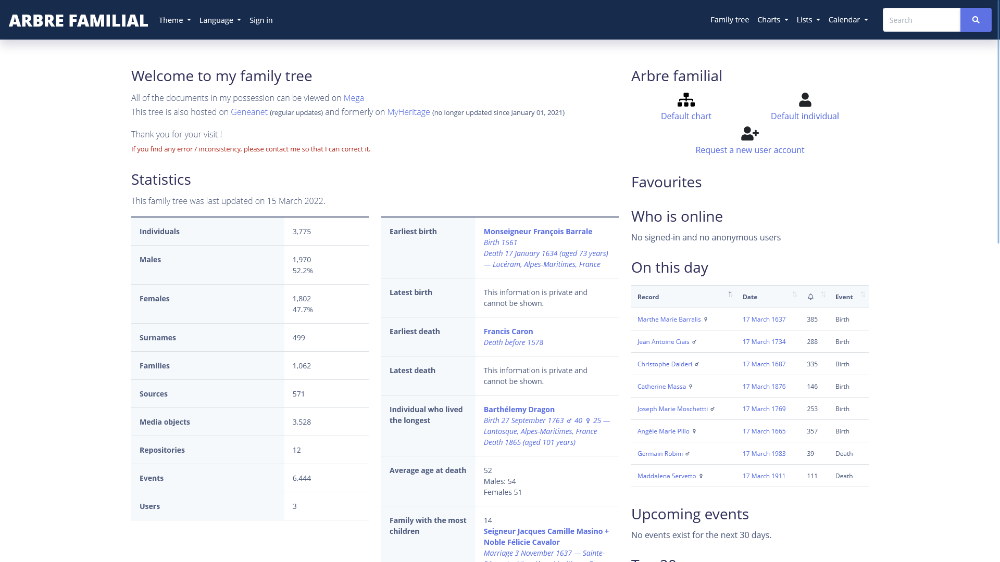
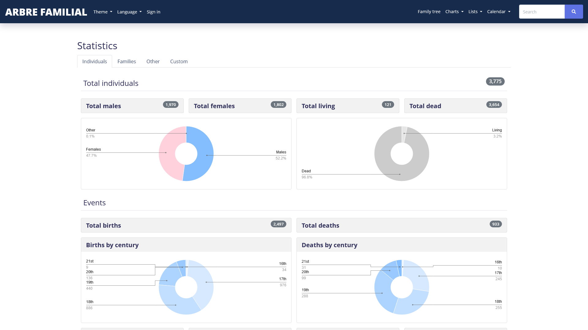
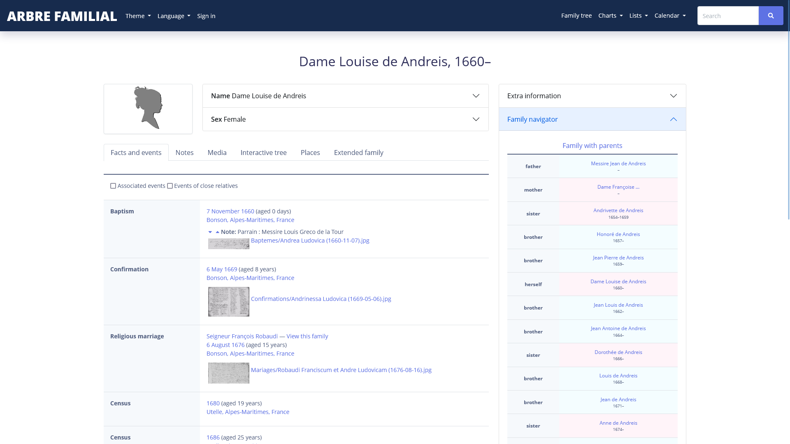
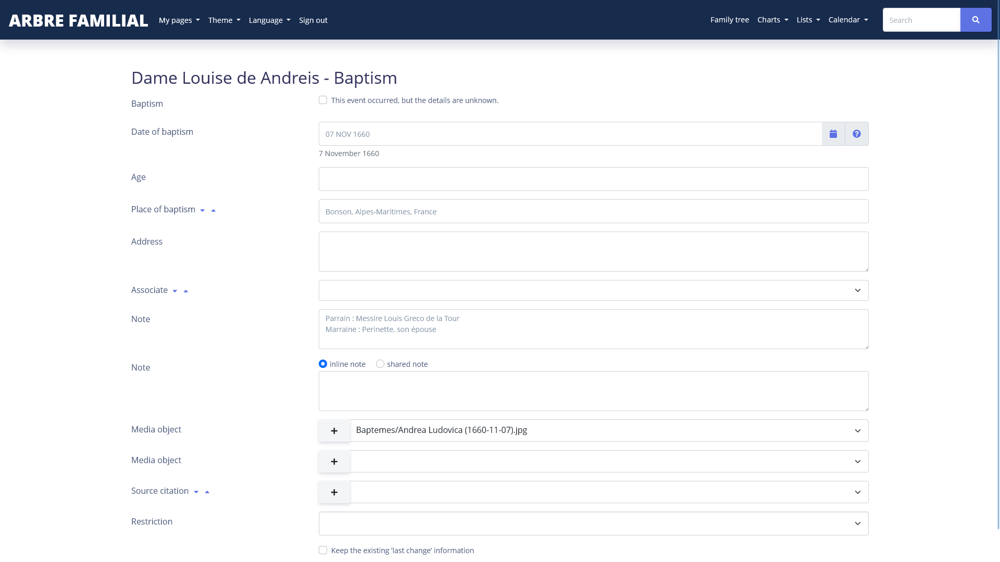
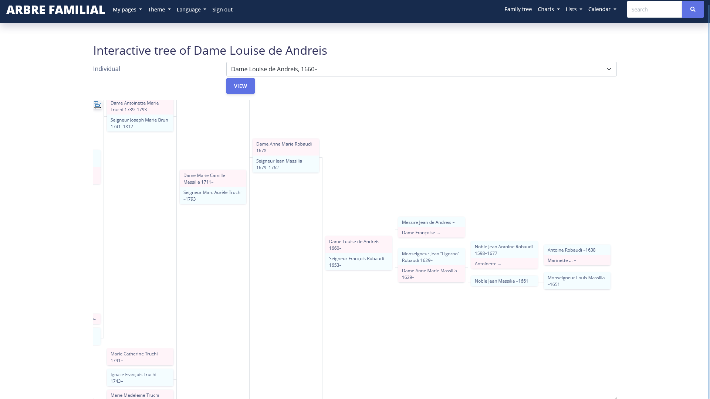
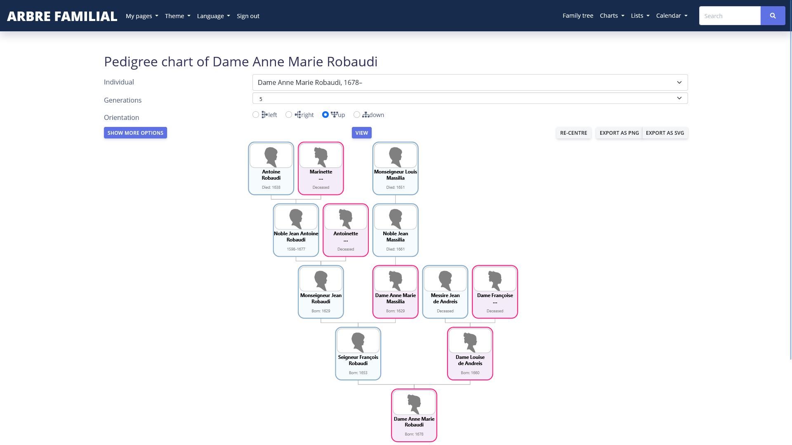

**[Argon Light Theme](https://github.com/06Games/Webtrees-ArgonLight)** is a fork of [Argon Theme for webtrees](https://github.com/jchue/argon-webtrees-theme) by jchue  
It adds a modern light theme to [Webtrees](https://github.com/fisharebest/webtrees) based on [Argon Design System](https://github.com/creativetimofficial/argon-design-system) by [Creative Tim](https://github.com/creativetimofficial)

> See also **[Argon Dark Theme](https://github.com/06Games/Webtrees-ArgonDark)** for a dark theme (Coming "*soon*")

This module is brought to you by [Evan Galli](https://github.com/06Games) under the [ISC License](https://choosealicense.com/licenses/isc/)

## Screenshots
|               Home               |                  Statistics                  |
|:--------------------------------:|:--------------------------------------------:|
|  |  |

|                  Individual                  |               Event                |
|:--------------------------------------------:|:----------------------------------:|
|  |  |

|                     Interactive tree                     | [Magicsunday's Pedigree chart](https://github.com/magicsunday/webtrees-pedigree-chart) |
|:--------------------------------------------------------:|:--------------------------------------------------------------------------------------:|
|  |               |

## Development
This module uses [composer](https://getcomposer.org/) and [gulp](https://gulpjs.com/) to manage its dependencies

```shell
composer install
npm install
gulp
```
